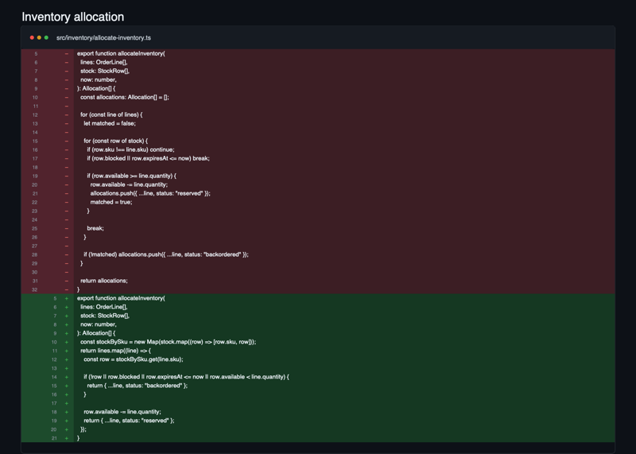

# McCabe's Razor

> Measure complexity. Don't game it.

Code can keep passing every test while becoming harder to understand. The fifth
edge case rarely breaks the function. It just turns a clear path into a maze.

## The idea

Cyclomatic complexity asks: **how many independent paths can this code take?**

Cognitive complexity asks: **how hard are those paths for a human to follow?**

Those are not the same question. These functions have the same decisions and
the same four paths:

```ts
function ship(order: Order) {
  if (order.paid) {
    if (order.inStock) {
      if (!order.flagged) {
        dispatch(order);
      }
    }
  }
}
```

```ts
function ship(order: Order) {
  if (!order.paid) return;
  if (!order.inStock) return;
  if (order.flagged) return;

  dispatch(order);
}
```

The first makes the reader remember three nested conditions before reaching the
work. The second keeps the successful path linear.

**Nesting does not necessarily create more decisions. It makes you hold more
decisions in your head at once.**

McCabe's Razor teaches coding agents to notice that difference. It shapes
decision-heavy code before writing it and cleans up existing hotspots without
shuffling the same branches into tiny helpers. Complexity scores are clues, not
targets. The goal is boring: simpler control flow, same behavior.

## Use

```text
Use McCabe's Razor while implementing this.
```

```text
Review this module with McCabe's Razor.
```

## Install

### Codex

> Use `$skill-installer` to install
> `https://github.com/batuhanbadak/mccabes-razor/tree/main/skills/mccabes-razor`.

### Claude Code

```text
/plugin marketplace add batuhanbadak/mccabes-razor
/plugin install mccabes-razor@mccabes-razor
```

## Examples

### Replace repeated event branches with one explicit lookup


### Replace a nested inventory scan with an indexed lookup



[MIT](./LICENSE)
